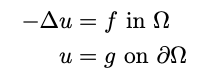
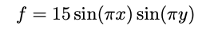
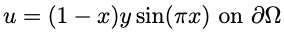
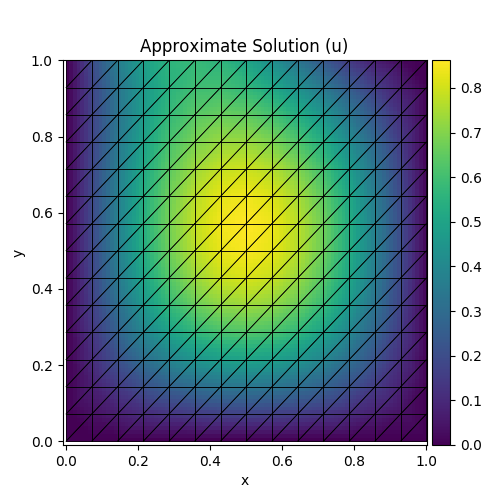
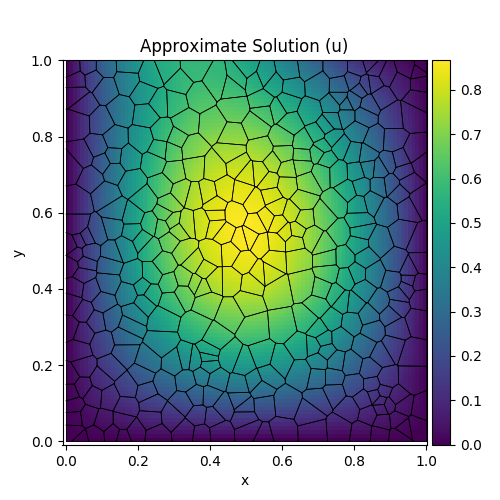
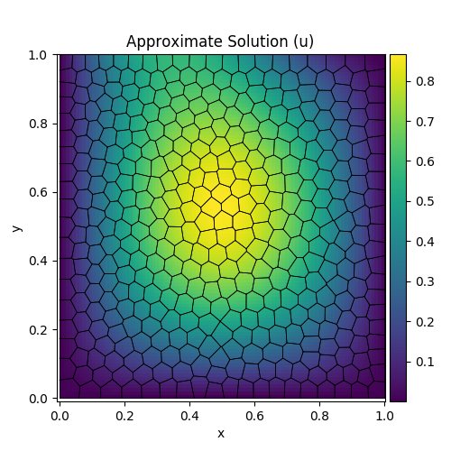
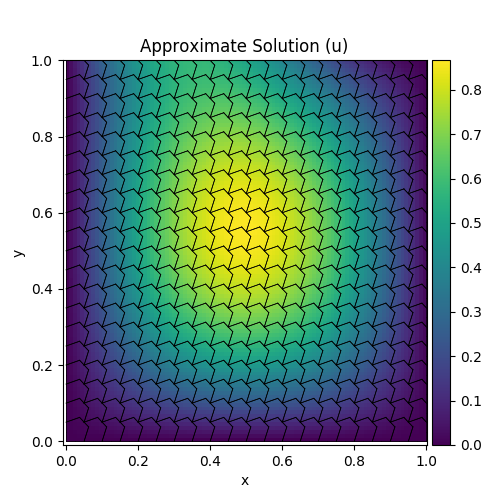

# Virtual Element Methods

This repository contains a Python translation of the code provided in:

>[The virtual element method in 50 lines of MATLAB. *Oliver J. Sutton*](https://dl.acm.org/doi/10.1007/s11075-016-0235-3)

It solves a toy problem, a 2-D poisson equation on generalized polygonal meshes, using the lowest order Virtual Element Methods.


## Usage

```
$ python3 vem.py --help
usage: vem.py [-h] [-d D] [-o O] [--save_plot] [--title TITLE] i

This script solves 2-D Poisson Equation on general polygonal meshes using
Virtual Element Methods of the lowest order.

positional arguments:
  i              Path to input mesh

optional arguments:
  -h, --help     show this help message and exit
  -d D           Specifies the shape of the 2D domain.
                 Possible values are:
                 - s: Square Domain
                 - l: L-Shaped Domain
  -o O           Path to output file
  --save_plot    Flag for saving the plot
  --title TITLE  Title of plot
```

The meshes can be downloaded from [here](http://www.netlib.org/numeralgo/) (available in the na45 package). A copy of the meshes is also provided in this repository in the `meshes` directory.


### Example Usage

```
$ Computing the solution of a 2-D poisson equation on a square mesh and square domain
python3 vem.py -d s meshes/square -o solution.npy --save_plot --title plot.png
```

## Some Results

Since this is a translation of the paper, this repository solved the exact toy problem that the paper has taken up, that is,





The solutions to this problem on different meshes in the square domain are shown below.


| **Mesh** | **Solution** |
|------|--------|
| Square    |    |
| Triangle    |       |
| Voronoi |  |
| Smoothed Voronoi |  |
| Non-convex |  |


